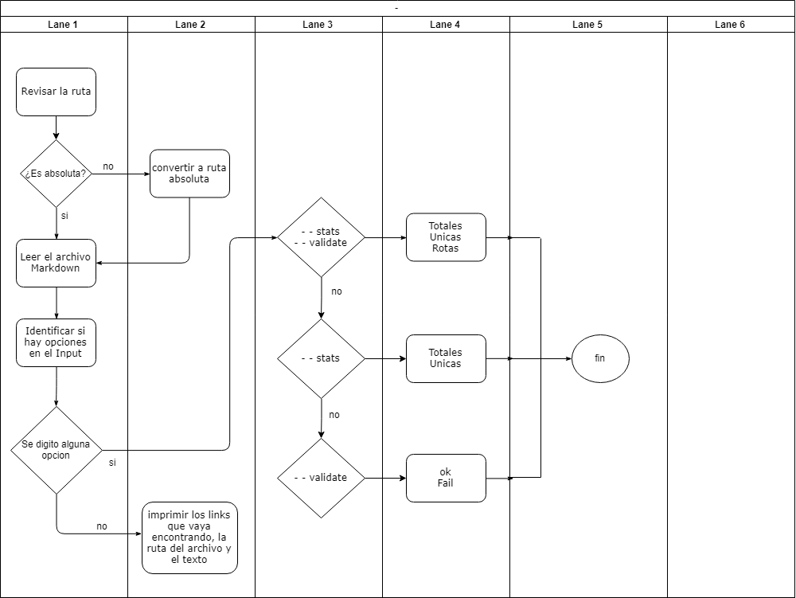

# Markdown Links


## Índice

* [1. Definicion General del proyecto](#1-Definición-General-del-Proyecto)
* [2. Especificación de Requerimientos](#2-Especificación-de-Requerimientos)
* [3. Install](#3-Install)

***

## 1. Definicion General del Proyecto

Crear una herramienta para Desarrolladores, usando [Node.js](https://nodejs.org/), que lea y analice archivos
en formato `Markdown`, para verificar los links que contengan y reportar
algunas estadísticas.

Diagrama de Flujo sobre el funcionamiento de la herramienta:



## 2. Especificación de Requerimientos

  1. Para el uso de esta herramienta usted requiere instalar [Node.js](https://nodejs.org/es/).
  2. Instalar un editor de código como Atom, Visual Studio Code o Sublime Text.
  3. Saber JavaScript y usar la consola.

## 3. Install

`npm i -G blank-md-links`


### Interfaz de Línea de Comando

El ejecutable de nuestra aplicación se ejecuta de la siguiente manera a través de la terminal:

`md-links <path-to-file> [options]`

Por ejemplo:

```sh
$ md-links ./some/example.md
./some/example.md http://algo.com/2/3/ Link a algo
./some/example.md https://otra-cosa.net/algun-doc.html algún doc
./some/example.md http://google.com/ Google
```

El comportamiento por defecto identifica el archivo markdown (a partir de la ruta que recibe como
argumento), analizar el archivo Markdown e imprimir los links que vaya
encontrando, junto con la ruta del archivo donde aparece y el texto
que hay dentro del link (truncado a 50 caracteres).

#### Options

##### `--validate`

Si pasamos la opción `--validate`, el módulo hace una petición HTTP para
averiguar si el link funciona o no. Si el link resulta en una redirección a una
URL que responde ok, entonces consideraremos el link como ok.

Por ejemplo:

```sh
$ md-links ./some/example.md --validate
./some/example.md http://algo.com/2/3/ ok 200 Link a algo
./some/example.md https://otra-cosa.net/algun-doc.html fail 404 algún doc
./some/example.md http://google.com/ ok 301 Google
```

##### `--stats`

Si pasamos la opción `--stats` el output (salida) será un texto con estadísticas
básicas sobre los links.

```sh
$ md-links ./some/example.md --stats
Total: 3
Unique: 3
```

También podemos combinar `--stats` y `--validate` para obtener estadísticas que
necesiten de los resultados de la validación.

```sh
$ md-links ./some/example.md --stats --validate
Total: 3
Unique: 3
Broken: 1
```